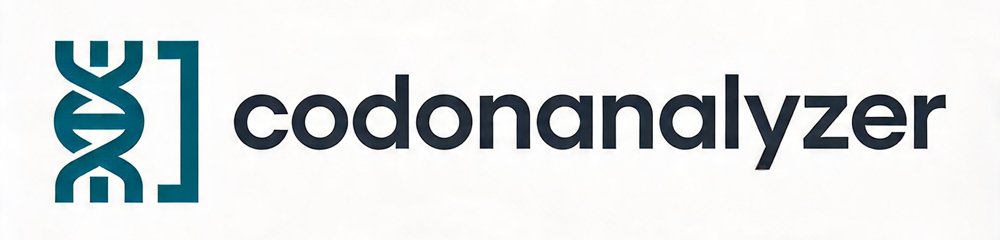

`codonanalyzer` is a Nextflow DSL2 pipeline for DNA multi-FASTA analysis with per-record fanout into Perl processing modules.

---

## [Documentation](https://bibymaths.github.io/codonanalyzer/)

---

## Author

Abhinav Mishra ([email](mailto:mishraabhinav36@gmail.com))

---

## License

BSD 3-Clause

---
