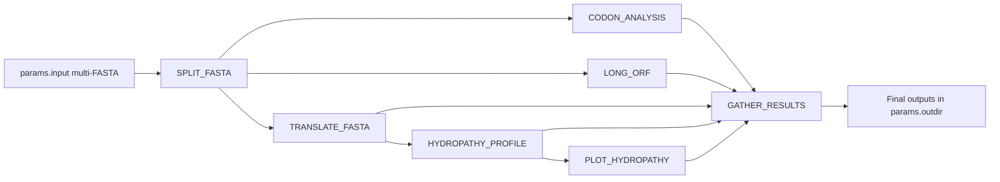

# codonanalyzer

!!! note
    `codonanalyzer` is a Nextflow DSL2 pipeline that runs codon usage, ORF detection, translation, and hydropathy analysis for each record in a DNA multi-FASTA file.

!!! tip
    For production runs on 96 cores / 1 TB RAM, use the `hpc` profile and tune `conf/resources.config` if your SLURM partition has stricter limits.

## End-to-end workflow

!!! warning
    Inputs with extremely long records can increase runtime in `CODON_ANALYSIS` and `LONG_ORF` because both scripts process complete sequence content.
