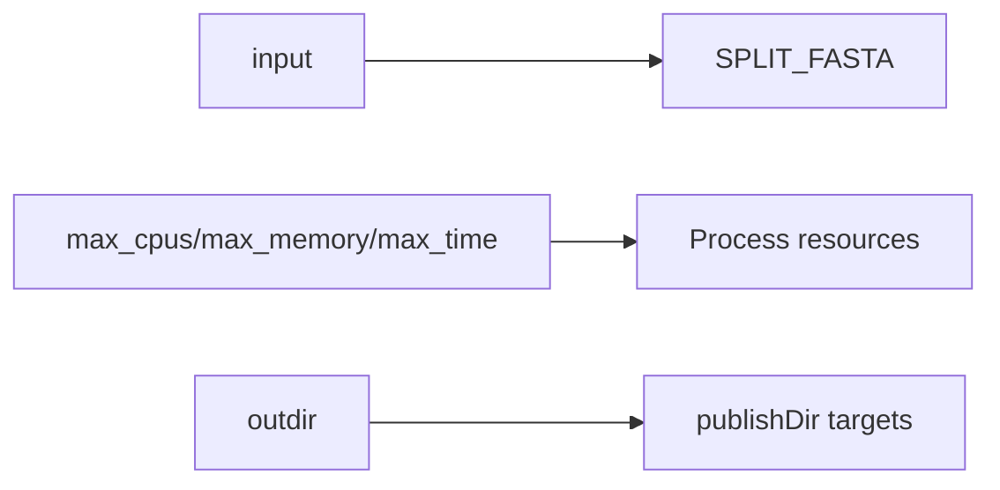

# Parameters

!!! note
    Parameter validation and help are driven by `nextflow_schema.json` using the `nf-schema` plugin in `main.nf` and `nextflow.config`.

!!! tip
    Regenerate parameter documentation from schema whenever parameter definitions change.

--8<-- "parameters.generated.md"

## Parameter DAG context

