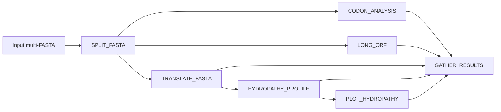

# Pipeline Overview

!!! note
    The DAG below reflects actual process names from `main.nf`.

## What each stage does

- `SPLIT_FASTA`: splits multi-FASTA into single-record FASTA files.
- `CODON_ANALYSIS`: runs `scripts/codon.pl` per record.
- `LONG_ORF`: runs `scripts/longORF.pl` per record.
- `TRANSLATE_FASTA`: runs `scripts/translate.pl` per record.
- `HYDROPATHY_PROFILE`: runs `scripts/hydropathy.pl` per record.
- `PLOT_HYDROPATHY`: runs `scripts/plot_hydro.py` per record.
- `GATHER_RESULTS`: merges all per-record outputs into final files.

!!! tip
    Intermediate files are published under `${params.outdir}/intermediate/` for auditability.
