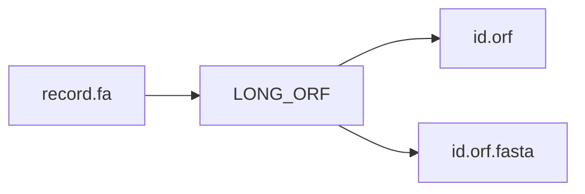
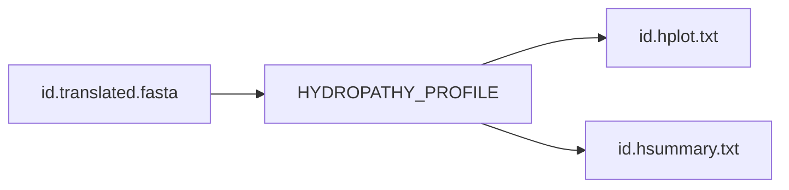
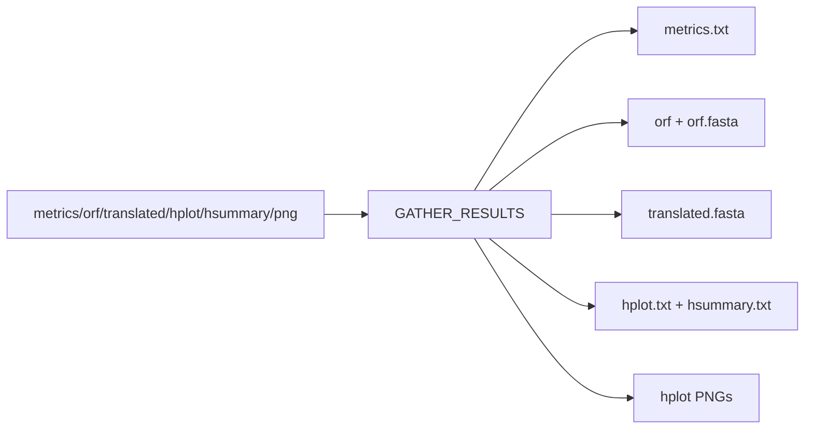

# Processes

## SPLIT_FASTA

!!! note
    Input: `params.input` multi-FASTA.

## CODON_ANALYSIS (`scripts/codon.pl`)

!!! warning
    This process computes many metrics, including codon-level and entropy statistics.

## LONG_ORF (`scripts/longORF.pl`)

## TRANSLATE_FASTA (`scripts/translate.pl`)

## HYDROPATHY_PROFILE (`scripts/hydropathy.pl`)

## PLOT_HYDROPATHY (`scripts/plot_hydro.py`)

## GATHER_RESULTS

!!! danger
    This is the terminal merge stage and rewrites combined outputs under `${params.outdir}/codonanalyzer_results/`.

