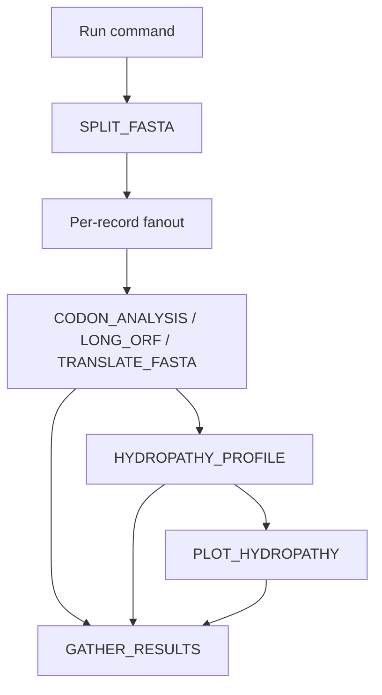

# Usage

!!! tip
    Use `-profile test` for smoke checks before full-scale datasets.

## Basic invocation

```bash
nextflow run main.nf \
  -profile standard \
  --input data/in.fasta \
  --outdir results
```

## Recommended production invocation (SLURM)

```bash
nextflow run main.nf \
  -profile hpc \
  --input /path/to/input.fasta \
  --outdir /path/to/output \
  --max_cpus 96 \
  --max_memory 1000.GB \
  --max_time 240.h
```

!!! warning
    The pipeline splits records first, so very high header counts (close to 1000) can generate many short jobs and increase scheduler overhead.

## Stage graph


